Na následující stránce naleznete poznámky k implementaci záznamu o výjezdu ZZS. Týkají se tvorby kompozice a naplnění tohoto profilu příslušnými daty.

### Přehled

```mermaid
classDiagram
  direction LR
  class CZ_BundleEms{
    <<Bundle>>
  }
  CZ_BundleEms *-- "1..1" CZ_CompositionEms
  CZ_BundleEms *-- "1..1" CZ_TaskEms
  CZ_BundleEms *-- "1..*" CZ_EncounterEms
  CZ_BundleEms *-- "1..*" CZ_PatientCore
  CZ_BundleEms *-- "0..*" CZ_Coverage
  CZ_BundleEms *-- "0..*" CZ_Practioner
  CZ_BundleEms *-- "0..*" CZ_DeviceObserver
  CZ_BundleEms *-- "0..*" CZ_OrganizationCore
  CZ_BundleEms *-- "0..*" CZ_CareTeamEms
  CZ_BundleEms *-- "0..*" CZ_CarePlanEms
  CZ_BundleEms *-- "0..*" CZ_CommunicationEms
  CZ_BundleEms *-- "0..*" CZ_ConditionEms
  CZ_BundleEms *-- "0..*" CZ_AllergyIntoleranceEms
  CZ_BundleEms *-- "0..*" CZ_FamilyMemberHistoryEms
  CZ_BundleEms *-- "0..*" CZ_FlagEms
  CZ_BundleEms *-- "0..*" CZ_ImmunizationEms
  CZ_BundleEms *-- "0..*" CZ_ImmunizationRecommendationEms
  CZ_BundleEms *-- "0..*" CZ_LocationEms
  CZ_BundleEms *-- "0..*" CZ_VehicleLocationEms
  CZ_BundleEms *-- "0..*" CZ_MedicationAdministrationEms
  CZ_BundleEms *-- "0..*" CZ_ProcedureEms
  CZ_BundleEms *-- "0..*" CZ_ObservationBMIEms
  CZ_BundleEms *-- "0..*" CZ_ObservationHeightEms
  CZ_BundleEms *-- "0..*" CZ_ObservationInfectiousContactEMS
  CZ_BundleEms *-- "0..*" CZ_ObservationOtherOFEms
  CZ_BundleEms *-- "0..*" CZ_ObservationOxygenEms
  CZ_BundleEms *-- "0..*" CZ_ObservationSDOHEMS
  CZ_BundleEms *-- "0..*" CZ_ObservationTravelEms
  CZ_BundleEms *-- "0..*" CZ_ObservationVitalSignsEms
  CZ_BundleEms *-- "0..*" CZ_ObservationWeightEms
  
  CZ_TaskEms --> CZ_CompositionEms: composition

  CZ_CompositionEms --> CZ_TaskEms: extension[basedOn]  
  CZ_CompositionEms --> CZ_EncounterEms: encounter
  CZ_CompositionEms --> CZ_Practioner: author[author]
  CZ_CompositionEms --> CZ_DeviceObserver: author[authoring-device]
  CZ_CompositionEms --> CZ_Practioner: informationRecipient[legalAuthenticator]
  CZ_CompositionEms --> CZ_OrganizationCore: custodian
  CZ_CompositionEms --> CZ_PatientCore: subject
  CZ_CompositionEms --> CZ_ObservationBMIEms: section[findings]
  CZ_CompositionEms --> CZ_ObservationHeightEms: section[findings]
  CZ_CompositionEms --> CZ_ObservationInfectiousContactEMS: section[findings]
  CZ_CompositionEms --> CZ_ObservationOtherOFEms: section[findings]
  CZ_CompositionEms --> CZ_ObservationOxygenEms: section[findings]
  CZ_CompositionEms --> CZ_ObservationSDOHEMS: section[findings]
  CZ_CompositionEms --> CZ_ObservationTravelEms: section[findings]
  CZ_CompositionEms --> CZ_ObservationVitalSignsEms: section[findings]
  CZ_CompositionEms --> CZ_ObservationWeightEms: section[findings]
  CZ_CompositionEms --> CZ_TaskEms: section[dispatch]
  CZ_CompositionEms --> CZ_LocationEms: section[dispatch]
  CZ_CompositionEms --> CZ_CommunicationEms: section[dispatch]
  CZ_CompositionEms --> CZ_VehicleLocationEms: section[dispatch]
  CZ_CompositionEms --> CZ_CareTeamEms: section[dispatch]
  CZ_CompositionEms --> CZ_Practioner: section[dispatch]
  CZ_CompositionEms --> CZ_PractionerRole: section[dispatch]
  CZ_CompositionEms --> CZ_RelatedPerson: section[dispatch]
  CZ_CompositionEms --> CZ_TaskEms: section[timeline]
  CZ_CompositionEms --> CZ_CommunicationEms: section[timeline]
  CZ_CompositionEms --> CZ_EncounterEms: section[timeline]
  CZ_CompositionEms --> CZ_ConditionEms: section[patientHx]
  CZ_CompositionEms --> CZ_MedicalDevice: section[medicalDevices]
  CZ_CompositionEms --> CZ_ProcedureEms: section[significantProcedures]
  CZ_CompositionEms --> CZ_ObservationTravelEms: section[TravelHx]
  CZ_CompositionEms --> CZ_ImmunizationEMS: section[immunizations]
  CZ_CompositionEms --> CZ_ImmunizationRecommendationEMS: section[immunizations]
  CZ_CompositionEms --> DocumentReference: section[immunizations]
  CZ_CompositionEms --> CZ_ObservationInfectiousContactEMS: section[infectiousContacts]
  CZ_CompositionEms --> CZ_FamilyMemberHistoryEms: section[familyHistory]
  CZ_CompositionEms --> CZ_ObservationSDOHEMS: section[socialHistory]
  CZ_CompositionEms --> Observation: section[alcoholUse]
  CZ_CompositionEms --> Observation: section[tobaccoUse]
  CZ_CompositionEms --> Observation: section[drugUse]
  CZ_CompositionEms --> CZ_AllergyIntoleranceEms: section[allergies]
  CZ_CompositionEms --> CZ_FlagEms: section[allergies]
  CZ_CompositionEms --> CZ_ProcedureEms: section[procedure]
  CZ_CompositionEms --> CZ_ConditionEms: section[diagnosticSummary]
  CZ_CompositionEms --> CZ_ProcedureEms: section[courseOfTreatment]
  CZ_CompositionEms --> CZ_CarePlanEms: section[recommendations]
  CZ_CompositionEms --> CZ_Coverage: section[payers]
  CZ_CompositionEms --> CZ_Logo: section[attachments]

```

Záznam je reprezentován jako FHIR bundle, který obsahuje zdroje CompositionEms a všechny zdroje ve stromové struktuře zdrojů, na které se odkazovalo (viz [$document operation](https://www.hl7.org/fhir/composition-operation-document.html)).

### Popis obsahu CZ_CompositionEms


